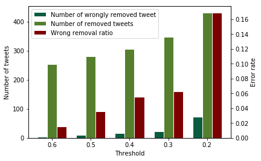
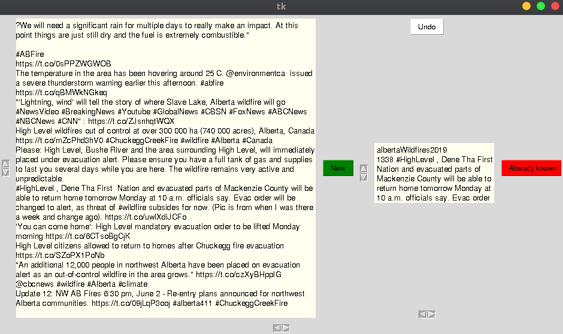

# Anti-redundancy

As reported in [1], an event could have been annotated by several assessors on disjointed sets of tweets. Some redundancy could thus remain in some events. 
To deal with those cases we automatically remove redundant tweets from the candidate gold standard (CGS) as follows.
Because of the excessive cost of a removal process entirely done manually, we adopted a two-phases approach. First, we automatically removed similar tweets regarding the ROUGE-2 metric. In order to set the optimal threshold used for ROUGE, we tested several values (see figure below). The threshold allowing to remove the highest number of tweets without too much loss of information (i.e., without wrongly removing tweets) is 0.3. All tweets getting a ROUGE-2 score greater or equal to 0.3 were thus removed from the CGS summaries.

In total 349 tweets were removed.
One can find below some examples of redundant tweets automatically detected:
* cases of correct redundancy removals
    * exactly the same tweet because of retweet
        
        Tweet 1: `RT : Italy earthquake: modern buildings, not ancient ones, pose biggest threat'
        
        Tweet 2: `Italy earthquake: modern buildings, not ancient ones, pose biggest threat ( video) -'

    * same information but differently expressed
    
        Tweet 1: `RT : Just released by the FBI: Suspect 1 and Suspect 2 in the Boston Marathon bombing'

        Tweet 2: `Photo of Suspects 1 and 2 in the Boston Marathon Bombings. \#boston \#FBI \#help'
        \end{itemize}
        
* cases of questionable removals
    * case of update of the event information using pattern
        
        Tweet 1: `RT : Revised (7.5 -> 7.4): 7.4 earthquake, 24km S of Champerico, Guatemala. Nov 7 10:35 at epicenter (20m ago, depth 42 ...'
        
        Tweet 2: `RT : Revised (6.6 -> 6.2): 6.2 earthquake, 24km WSW of Champerico, Guatemala. Nov 11 16:15 at epicenter (14m ago, depth ...'
        
    * reference to the event oversizing the redundancy (11 tweets only in this case)
        
        Tweet 1: `Google exec dies in Mt. Everest avalanche after \#NepalEarthquake'
        
        Tweet 2: `Mt. Everest avalanche survivor speaks.'

We then manually checked the filtered CGSs using an assessment tool we specifically developed. A screen of this tool interface is depicted below. For a given event, tweets are presented in chronological order. 
For each tweet, the contained information is annotated as New or Already known. The tweets labeled as New are added to be used as annotator memory and help him/her to label next tweets. Each labeling action can be undone thanks to the button.
After this phase, 174 tweets are skipped from the summaries.

[1] Mccreadie, R., Buntain, C., and Soboroff, I. (2019). TREC Incident Streams: FindingActionable Information on Social Media. In16th Int. Conf. on Information Systems forCrisis Response and Management (ISCRAM 2019).